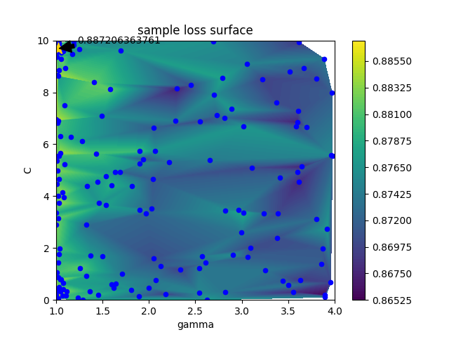

# Ikaros 

Automated model building with sklearn.  The ultimate evolution in Automated Model Building Optimization (AMBO).


## Description

`ikaros` provides a framework for optimizing the various meta-parameters of a pipeline.  In many pipelines, there 
are three primary stages:

* Preprocessing: This includes operations such as thresholding, dimension reduction, oversampling, kernel estimation, etc.
* Classification/Regression: Build multiple estimators to perform the classification/regression task
* Ensembling: Combine results from stage two to produce the final output

Within each stage, it is often the case that the ordering is flexible.  `ikaros` provides stages that allow for exploration
of permuted orderings.  It is almost always the case that each stage has multiple processes that each have several meta-parameters.
It can be quite difficult, owing to the large nature of the parameter space, to find the optimum set of parameters.  `ikaros`
provides a bayesian optimization search over the space of both continuous and discrete parameters.




## Motivating Example
```
from ikaros.pipeline import IPipeline
from ikaros.stages   import SequentialStage, StackedStage
from ikaros.sampling import discrete, continuous

def sample_loss( estimator, X, y ):
    return cross_val_score(estimator,
                           X,
                           y=y,
                           scoring='roc_auc',
                           cv=2).mean()
...
X, y = make_classification(n_samples=1000,
                           n_features=10,
                           n_informative=8,
                           n_redundant=2)

s1 = SequentialStage()
s1.add( VarianceThreshold, params={ 'threshold' : continuous( 0, 0.05 ) } )
s1.add( StandardScaler )
s1.add( SMOTE, params={ 'k_neighbors' : discrete( [ 5, 6, 7 ] ) } )

s2 = StackedStage()
s2.add( KNeighborsClassifier, params={ 'n_neighbors' : discrete( xrange(5,30,8) ),
                                       'weights' : discrete( [ 'uniform', 'distance' ] ) } )
s2.add( RandomForestClassifier, params={ 'n_estimators' : discrete( xrange(10,500,200) ) } )
s2.add( LogisticRegression, params={ 'C' : continuous(0.001,10) } )

ik = IPipeline( stages=[s1,s2], loss=partial(sample_loss,X=X,y=y), verbose=True )

ik.fit( X, y )
ik.optimize(10)

print( '{}: {}'.format(ik.best_score_, ik.best_estimator_.get_params()) )
```
### Prerequisites

```pip install -r requirements.txt```

## Contributing

Please read CONTRIBUTING.md for details on our code of conduct, and the process for submitting pull requests to us.

## Versioning

We use [SemVer](http://semver.org/) for versioning. For the versions available, see the [tags on this repository](https://git.xogrp.com/CoreTechnologies/ikaros/tags). 

## Authors

* **Kris Pickrell**

See also the list of [contributors](https://git.xogrp.com/CoreTechnologies/ikaros/contributors) who participated in this project.

## License

This project is licensed under the MIT License - see the [LICENSE.md](LICENSE.md) file for details

## Acknowledgments

* Hat tip to anyone who's ideas were used
* Inspiration
* etc
